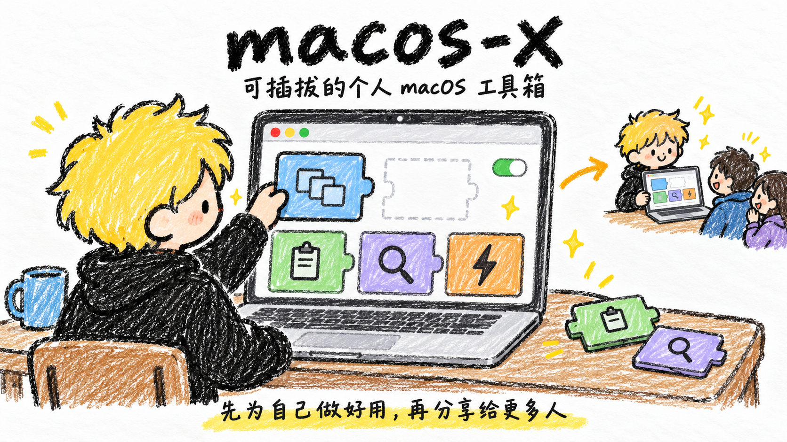

<p align="center">
  
</p>

从日常小需求出发，把 Mac 用得更顺手。功能按需启停，先自用打磨，再分享。

当前从 **窗口切换（⌥Tab）** 开始，面向当前桌面的可见普通窗口；已接入签名 OTA 更新。

macOS 14+ · Apple Silicon · 个人开发版 · 未公证

[下载 macOS](https://github.com/anjing-le/macos-x/releases/latest) · [协作约定](AGENTS.md)

首次使用需从菜单栏授权辅助功能；缩略图另需屏幕录制权限。

<details>
<summary>开发与验证</summary>

原生 Swift / AppKit，内置模块可独立启停。构建与发布参数见 [scripts](scripts/)。

```sh
swift test --disable-keychain
./scripts/build.sh
```

构建、核心测试和更新签名校验已通过；真实窗口交互与 OTA 安装重启仍待实测。

</details>
